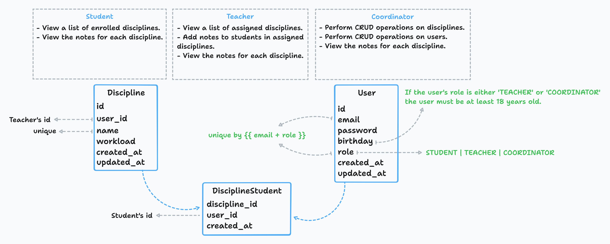
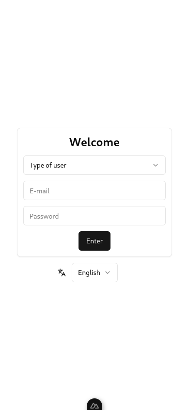
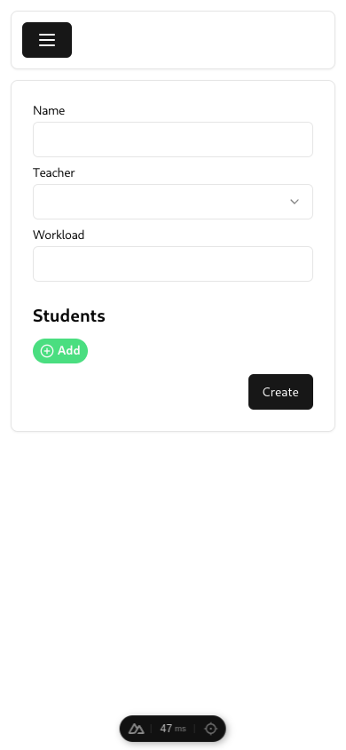
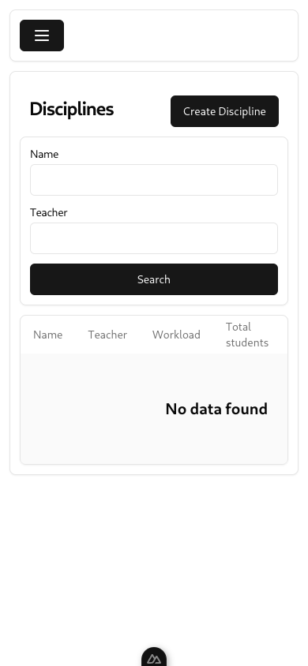
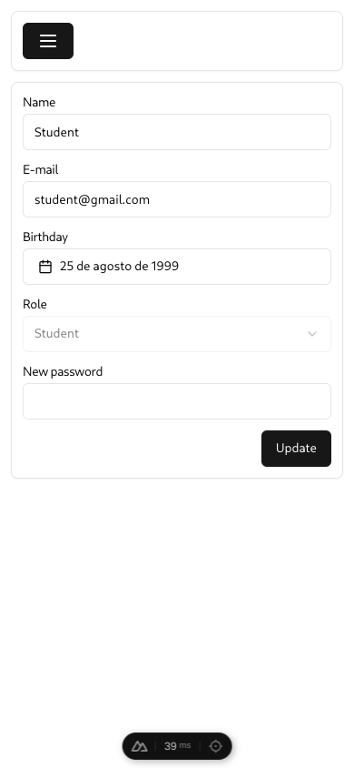
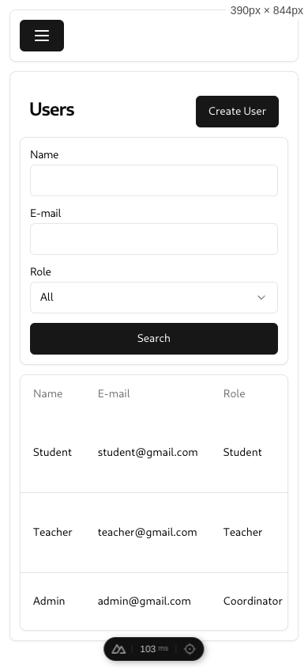

<h1 align="center">
    Django + Nuxt POC
</h1>

<p align="center">
    
    
    
    
    
    
</p>

# Getting Started

### Backend

1. Create your environment with [venv](https://docs.python.org/3/library/venv.html)
2. Enter in the environment and activate it with
```bash
$ source ./bin/activate
```
3. Clone the repository
```bash
$ git clone https://github.com/AntonyZ89/django-nuxt-poc
```
4. Install requirements
```bash
$ cd backend
$ pip install -r requirements.txt
```
5. Run server
```bash
$ python manage.py runserver
```

### Frontend

1. Install dependencies
```bash
$ cd frontend
$ bun install
```

2. Copy `.env.local.example`
```bash
$ cp .env.local.example .env.local
```

3. Run server
```bash
$ bun run dev
```

## Tables

`DISCIPLINE`

| Field    | Description  |
|----------|--------------|
| id       |              |
| user_id  | teacher's id |
| name     |              |
| workload |              |

`USER`

| Field       | Description                                       |
|-------------|---------------------------------------------------|
| name        |                                                   |
| email       | (Can be the same if the "user type" is different) |
| password    |                                                   |
| birthday    | (Must be of legal age)                            |
| created_at  |                                                   |
| updated_at  |                                                   |
| role        | **TEACHER**, **STUDENT**, **COORDINATOR**         |

`DISCIPLINE_STUDENT`

| Field          | Description  |
|----------------|--------------|
| discipline_id  |              |
| user_id        | student's id |

## ROLES

| Role        | Permissions                                             |
|-------------|---------------------------------------------------------|
| TEACHER     | List disciplines, Add notes, View notes                 |
| COORDINATOR | CRUD discipline, CRUD user, Add professor, Add students |
| STUDENT     | List disciplines, View notes                            |

## FRONTEND

- Login
- CRUD disciplines
- CRUD users
- Libraries:
  - Shadcn Vue for components
  - Tailwind
  - TypeScript
  - Nuxt (framework)
  - Pinia (state management)
  - Vee-validate (form validation)
    - Zod (validation management)
  - Nuxt-i18n
    - English
    - Spanish
    - Portuguese

1. Upon login, the user selects their role: `Teacher`, `Coordinator`, or `Student`, and is then redirected to the corresponding frontend.
2. Items on the screen are hidden based on the user's role.
3. If attempting to access a route without logging in, the user will be redirected to the login screen.
4. If attempting to access a route without permission, the user will be redirected to the home screen.

## BACKEND

- All CRUD operations using GenericViewSet/ModelViewSet
  - CRUD disciplines
  - CRUD users
  - CRUD discipline-students
- Models
  - User
    - Subtypes (proxy)
      - Student
      - Teacher
      - Coordinator
  - Discipline
  - DisciplineStudent
  - Serializers
    - Login
    - Discipline
    - DisciplineStudent
    - Entity
      - User
      - Student
      - Teacher
      - Coordinator
  - Response
    - NotFound
    - Token
- Unit tests
  - Models and serializers
  - Using fixtures
- Token Auth
- Documentation (automatic)
  - Swagger
  - Redoc

